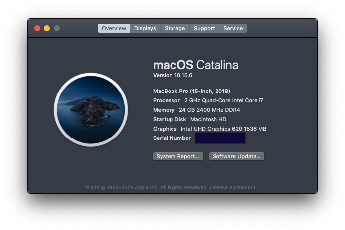

# Hackintosh for MSI PS63 Modern
## Specifications
| Part        | Model | Note |
| ----------- | ----------- | --- |
| CPU      | Intel Core i7-8565U       | 
| Integrated GPU   | Intel UHD Graphic 620        |
| Dedicated GPU   | NVIDIA GTX1050 Max-Q        |
| RAM   | DDR4-2400 SO-DIMM 24GB        |
| SSD 1  | Transcend 220s 1TB        |
| SSD 2  | HP SATA M.2 SSD 512GB        | Installed macOS on this drive
| Screen   | 15.6' IPS 1920 × 1080         |
| Wi-Fi/Bluetooth   | Intel Wireless AC9560        | Works by using itlwm kext
| Card Reader   | Realtek        |
| Webcam   | 720p        | Keyboard Toggle (Fn + F6) works perfectly

## Hackintosh Status

Here is what I installed and used as a daily driver.
- **Operating Systems** - Dual-boot macOS Catalina 10.15.6 and Windows 10 each on its own SSD.
- **OpenCore** - version 0.6.0

### Checklist
Here is a list of what works, what don't.
- [x] CPU Power Management
- [x] Sleep
- [x] Battery Monitoring
- [x] Integrated GPU
    - [x] HDMI
        - Not tested with screens with a resolution greater than FHD
        - Not tested for audio output
        - [ ] USB Type-C to HDMI via a dongle 
- [x] Sound + Microphone
    - [x] Audio Jack (Hotpluggable)
    - [x] Speaker
- [x] Wi-Fi (Works but slower than usual)
- [x] Bluetooth
- [x] Webcam
- [x] Trackpad
    - [x] macOS native gestures
- [x] Keyboard
    - [x] Brightness and volume up/down keys
    - [x] Print Screen key (Mapped it to macOS's F13)
    - [x] Webcam/Built-in Microphone key (Fn + F6)
- [ ] Fingerprint Sensor (There is no workaround.)
- [ ] Card Reader (There is no workaround.)

### To-Do List
- [ ] Add OpenCore Boot Picker GUI
- [ ] Install an actual Broadcom Wi-Fi NIC
- [ ] Adjust the trackpad so that it feel better to use.
- [ ] Upgrade to a newer OpenCore version
- [ ] Update macOS to Big Sur
- [ ] Make DRM works for Apple TV
- [ ] Swap from itlwm (for Intel Wi-Fi) to airportItlwm for better user experiences.

### Guide Used
- Installation Guide: https://dortania.github.io/OpenCore-Install-Guide/
- Post-installation Guide: https://dortania.github.io/OpenCore-Post-Install/

#### Prerequisites
##### Bios
- Turn off Secure Boot
- Turn off CFG Lock
    1. Enter the Bios
    2. Press ALT + right CTRL + F2 + right SHIFT to enable advanced BIOS Menu
    3. Power & Performance
    4. CPU - Power Management Control
    5. CPU Lock Configuration
    6. CFG Lock

##### SMBIOS
I used MacBook Pro 15, 2018 SMBIOS.

#### Post Installation Checklist
Checked item means I already followed the guide in that section. Please note that the hierarchy follows [this guide](https://dortania.github.io/OpenCore-Post-Install/universal/sleep.html#audio).
- Universal
    - [ ] Security and FileVault
    - [x] Fixing Audio
    - [ ] Booting without USB
    - [ ] Updating OpenCore, kexts and macOS
    - [x] Fixing DRM
    - [x] Fixing iServices
    - [x] Fixing Power Management
    - [x] Fixing Sleep
        - [x] USB   
            - [x] USB Mapping
            - [x] Fixing USB Power
            - [x] Fixing Shutdown/Restart
            - [ ] GPRW/UPRW/LANC Instant Wake Patch
            - [ ] Keyboard Wake Issues
        - [x] GPU 
            - [x] Disabling laptop dGPU
        - [ ] ~~- Thunderbolt~~
        - [ ] NICs
        - [x] NVMe
        - [x] CPU Power Management
        - [ ] Displays
        - [x] NVRAM
        - [x] RTC
        - [x] IRQ Conflicts
        - [x] Audio
        - [ ] SMBus
        - [ ] TSC
    - [x] Fixing USB
- Laptop Specifics
    - [ ] Fixing Battery Read-outs (Didn't follow because it is already work out-of-the-box)
- Cosmetics
    - [ ] Add GUI and Boot-chime
    - [ ] Fixing Resolution and Verbose
- Multiboot
    - [ ] Setting up Bootstrap.efi
    - [ ] Installing BootCamp
- Miscellaneous
    - [x] Fixing RTC
    - [ ] Fixing CFG Lock
    - [x] Emulated NVRAM
### Advices
Since I cannot remember all the details how I configured the EFI. Here are some tips following the guide.
- Read the guide multiple times.
- Follow the provided guide carefully.
- Make a checklist for post-installation tasks.
- Always Backup your EFI
    - Use Git (Like what I do here) for Version Controlling
    
#### Not Enough EFI Space?
Backup your EFI Partition then follow this: https://www.youtube.com/watch?v=YaPVaAifjl0&ab_channel=LazyTech to expand your EFI partition capacity.

## Credits
Thanks the owners of OpenCore, kexts, guides and tools that I have used to make this possible even though I cannot list everyone's name.

